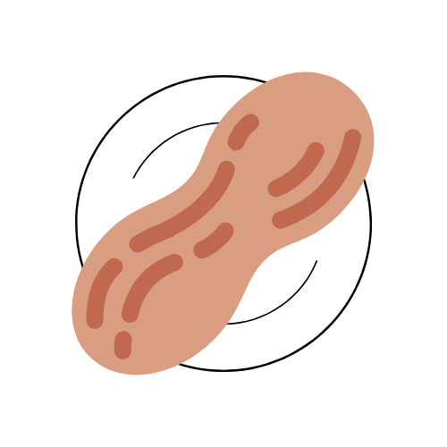

<div align="center">

  
  <h1>Deez Nuts Jokes API</h1>
  
  <p>
    The Deez Nuts Jokes API allows users to access a collection of jokes about Deez Nuts to use in their applications. 🥜 
    Also available on <a href="https://rapidapi.com/DeviousLab/api/deez-nuts-jokes">RapidAPI</a>.
  </p>
  <p>
    A wrapper built with TypeScript/JavaScript is also available on <a href="https://www.npmjs.com/package/dnjokes-api-wrapper">npm</a>.
  </p>

  
<!-- Badges -->
<p>
  <a href="">
    
  </a>
  <a href="https://github.com/DeviousLab/DNJokes-API/stargazers">
    
  </a>
  <a href="https://github.com/DeviousLab/DNJokes-API/issues/">
    
  </a>
  <a href="https://github.com/DeviousLab/DNJokes-API/blob/master/LICENSE">
    
  </a>
</p>
   
<h4>
    <a href="https://github.com/DeviousLab/DNJokes-API/issues/new?assignees=DeviousLab&labels=bug&template=bug_report.md&title=%5BBug%5D">Report Bug</a>
  <span> · </span>
    <a href="https://github.com/DeviousLab/DNJokes-API/issues/new?assignees=DeviousLab&labels=enhancement&template=joke-suggestion.md&title=%5BSuggestion%5D+">Suggest a joke</a>
  </h4>
</div>

<br />

<!-- Table of Contents -->
# :notebook_with_decorative_cover: Table of Contents

- [About the Project](#star2-about-the-project)
  * [Tech Stack](#space_invader-tech-stack)
  * [Features](#dart-features)
  * [Environment Variables](#key-environment-variables)
- [Getting Started](#toolbox-getting-started)
  * [Run Locally](#running-run-locally)
- [Roadmap](#compass-roadmap)
- [Contributing](#wave-contributing)
- [License](#warning-license)
- [Contact](#handshake-contact)
- [Acknowledgements](#gem-acknowledgements)
  

<!-- TechStack -->
### :space_invader: Tech Stack

  <ul>
    <li><a href="https://fastapi.tiangolo.com/">FastAPI</a></li>
    <li><a href="https://supabase.com/">Supabase</a></li>
    <li><a href="https://docs.pytest.org/en/7.1.x/">PyTest</a></li>
    <li><a href="https://slowapi.readthedocs.io/en/latest/">SlowAPI</a></li>
    <li><a href="https://www.deta.sh/">Deta</a></li>
  </ul>

<!-- Features -->
### :dart: Features

- Get an array of all jokes in the database
```
curl -X 'GET' \
  'https://deezjokes.deta.dev/jokes' \
  -H 'accept: application/json'
```
- Get a random joke from the database
```
curl -X 'GET' \
  'https://deezjokes.deta.dev/joke/random' \
  -H 'accept: application/json'
```
- Get a joke by ID
```
curl -X 'GET' \
  'https://deezjokes.deta.dev/joke/1' \
  -H 'accept: application/json'
```
- Get a joke by search query
```
curl -X 'GET' \
  'https://deezjokes.deta.dev/joke/search?keyword=boba' \
  -H 'accept: application/json'
```

<!-- Env Variables -->
### :key: Environment Variables

To run this project, you will need to add the following environment variables to your .env file

`SUPABASE_SUPAFAST_URL` and `SUPABASE_SUPAFAST_KEY`

<!-- Getting Started -->
## 	:toolbox: Getting Started

<!-- Run Locally -->
### :running: Run Locally

Clone the project

```bash
  $ git clone https://github.com/DeviousLab/DNJokes-API.git
```

Go to the project directory

```bash
  $ cd DNJokes-API/api
```

Install dependencies

```bash
  $ pip install -r requirements.txt
```

Start the server

```bash
  $ uvicorn main:app --reload
```

<!-- Roadmap -->
## :compass: Roadmap

* [ ] ~~Add handler to suggest new jokes~~
* [X] Setup issue/PR templates
* [X] Develop NodeJS/Typescript wrapper for API

<!-- Contributing -->
## :wave: Contributing

Contributions are always welcome! Open an issue with any issues or requests!

<!-- License -->
## :warning: License

Distributed under the MIT License. See `LICENSE.md` for more information.


<!-- Contact -->
## :handshake: Contact

[devious@deviouslab.dev](mailto:devious@deviouslab.dev)
[deviouslab.dev](https://deviouslab.dev)

<!-- Acknowledgments -->
## :gem: Acknowledgements

Use this section to mention useful resources and libraries that you have used in your projects.

 - [Shields.io](https://shields.io/)
 - [Readme Template](https://github.com/othneildrew/Best-README-Template)
 - [@aUnicornDev](https://aunicorndev.hashnode.dev/supabase-fastapi-setting-up-supabase)
